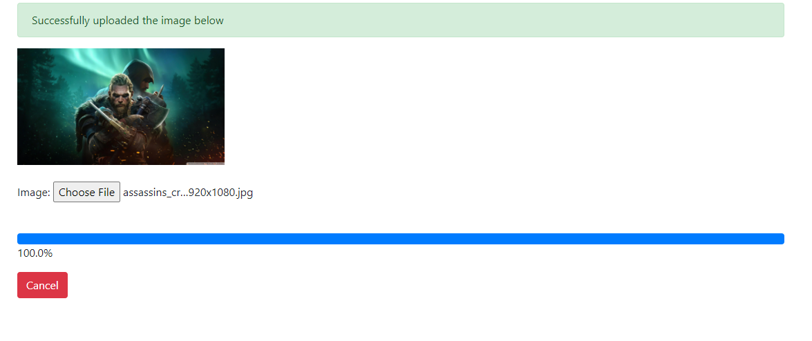

<div align="center">
<h1>Django file upload progress bar</h1>

</div>

<h4>A django app to demonstrate ajax call on file upload along with the progress bar.<h4>

## Installation steps

Clone the Repo and install the requirements

```
git clone https://github.com/saadhaxxan/Django-file-upload-progress-bar.git
cd Django-file-upload-progress-bar
pip install -r requirements.txt
python manage.py makemigrations
python manage.py migrate
python manage.py runserver
```

## Integrate into an Existing Application

### 1. Add into installed Apps
```
INSTALLED_APPS = [
    'django.contrib.admin',
    'django.contrib.auth',
    'django.contrib.contenttypes',
    'django.contrib.sessions',
    'django.contrib.messages',
    'django.contrib.staticfiles',
    'uploads',
]
```

### 2. Copy main.js into static folder

## Author
You can get in touch with me on my LinkedIn Profile:

#### Saad Hassan
[](https://www.linkedin.com/in/saadhaxxan)

You can also follow my GitHub Profile to stay updated about my latest projects: [](https://github.com/saadhaxxan)

If you liked the repo then kindly support it by giving it a star ⭐!

## Contributions Welcome
[](#)

If you find any bug in the code or have any improvements in mind then feel free to generate a pull request.

